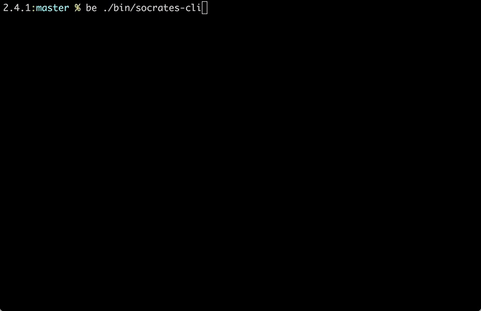

# Socrates

Socrates is a micro-framework for building stateful conversational interfaces. It provides straight-forward state management, a clear pattern for modeling the states and conversational flow (transitions), and some helpers.
 
 It's designed for building conversational Slack bots, but is designed in such a way that other adapters could be written. It ships with a Console adapter for testing locally in the terminal as well as a Memory adapter for use in automated tests.

*Disclaimer: This framework is currently experimental and will change.*

Conceptually, a conversation is a sequence of asking and listening actions. As a conversation progresses, information is gathered and at some point, acted upon by the system.

Conversational state is captured either in memory (development and testing) or in Redis. This too is pluggable so that other storage backends could be used.

Here is a simple example, asking for one's name, birth date, and then responding with the current age.



```ruby
class GetStarted
  include Socrates::Core::State

  def listen(message)
    case message.downcase
      when "help"
        transition_to :help
      when "age"
        transition_to :ask_for_name
      else
        transition_to :no_comprende
    end
  end
end

class Help
  include Socrates::Core::State

  def ask
    respond message: <<~MSG
      Thanks for asking! I can do these things for you...

        • `age` - Calculate your age from your birth date.
        • `help` - Tell you what I can do for you.

      So, what shall it be?
    MSG
    transition_to :get_started, action: :listen
  end
end

class NoComprende
  include Socrates::Core::State

  def ask
    respond message: "Whoops, I don't know what you mean by that. Try `help` to see my commands."
    transition_to :get_started
  end
end

class AskForName
  include Socrates::Core::State

  def ask
    respond message: "First things first, what's your name?"
  end

  def listen(message)
    # Transition to the next step while persisting the name for future retrieval.
    transition_to :ask_for_birth_date, data: { name: message }
  end
end

class AskForBirthDate
  include Socrates::Core::State

  def ask
    respond message: "Hi #{first_name}! What's your birth date (e.g. MM/DD/YYYY)?"
  end

  def listen(message)
    begin
      birth_date = Date.strptime(message, "%m/%d/%Y")
    rescue ArgumentError
      respond message: "Whoops, I didn't understand that. What's your birth date (e.g. MM/DD/YYYY)?"
      repeat_action
      return
    end
    # Transition to the next step while persisting the birth date for future retrieval.
    transition_to :calculate_age, data: { birth_date: birth_date }
  end

  private

  def first_name
    @data.get(:name).split.first
  end
end

class CalculateAge
  include Socrates::Core::State

  def ask
    respond message: "Got it #{first_name}! So that makes you #{calculate_age} years old."
    end_conversation
  end

  private

  def first_name
    @data.get(:name).split.first
  end

  def birth_date
    @data.get(:birth_date)
  end

  def calculate_age
    ((Date.today.to_time - birth_date.to_time) / 1.year).floor
  end
end
```

## Installation

Add this line to your application's Gemfile:

```ruby
gem 'socrates'
```

And then execute:

    $ bundle

Or install it yourself as:

    $ gem install socrates

## Usage

Socrates is intended to be used programmatically from your application.

However, it's easy to see a sample conversation run in either the console or on Slack. 

To see socrates in action in the console:

    $ socrates run

And on Slack:
    
    $ SLACK_API_TOKEN=<your token> socrates -a slack run
    
Use `-s redis` to store state in Redis instead of memory. The key difference is that state will survive exiting and
restarting the bot. Use the `-d` flag for debugging log information.

## Core Concepts

* Dispatcher - Kicks off conversations, responds to input, and provides general state managements.
* Session - Buffers messages to channels, until flushed by an Adapter.
* Adapter (Slack, Console, Memory) - Captures service specific functionality.
* Storage (Memory, Redis) - Handles persisting conversational state.
* State - Represents a state of a conversation, provides helpers for state implementations.
* Helpers - Simple helpers.

TODO: Expand descriptions. Include a diagram.

## Development

After checking out the repo, run `bin/setup` to install dependencies. Then, run `rake` to run the specs and rubocop. You can also run `bin/console` for an interactive prompt that will allow you to experiment.

To install this gem onto your local machine, run `bundle exec rake install`. To release a new version, update the version number in `version.rb`, and then run `bundle exec rake release`, which will create a git tag for the version, push git commits and tags, and push the `.gem` file to [rubygems.org](https://rubygems.org).

## Contributing

Bug reports and pull requests are welcome on GitHub at https://github.com/carbonfive/socrates.

